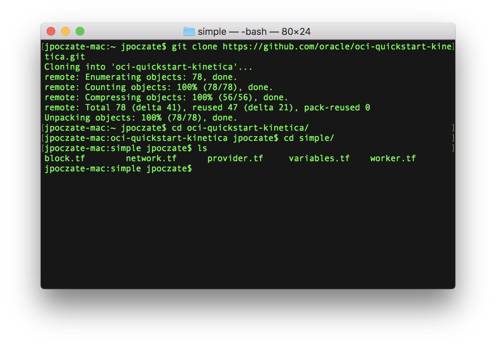
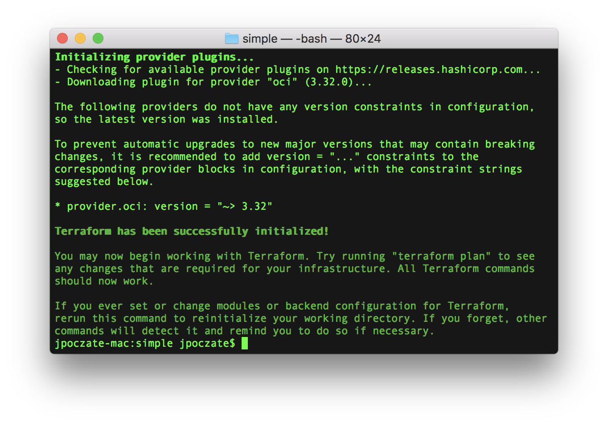
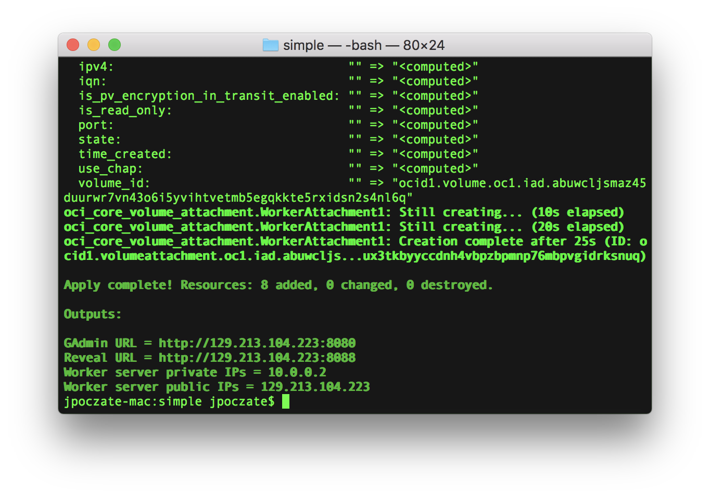
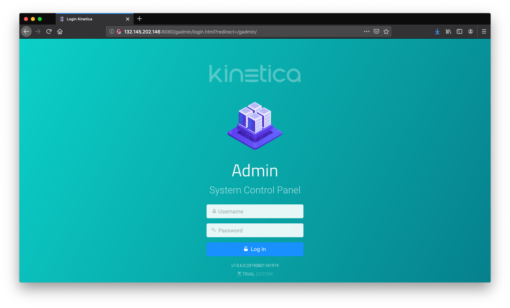
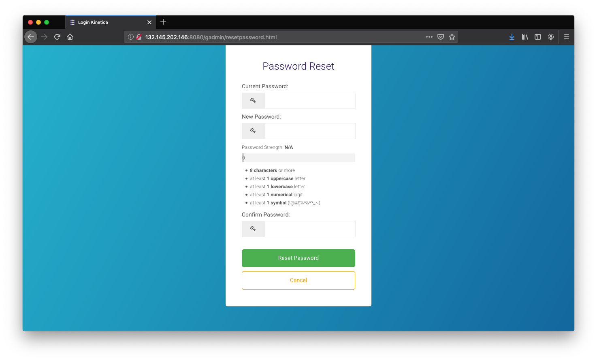
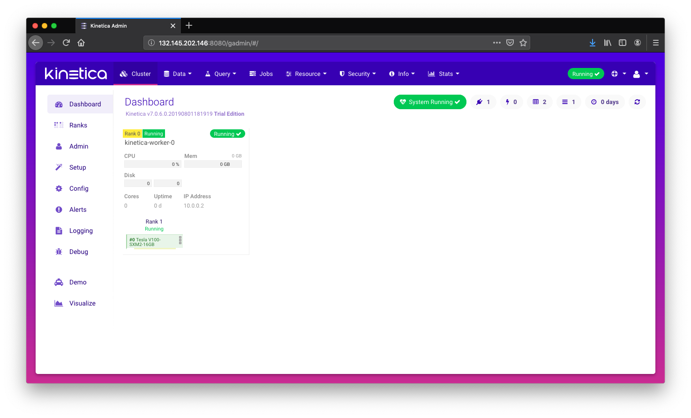
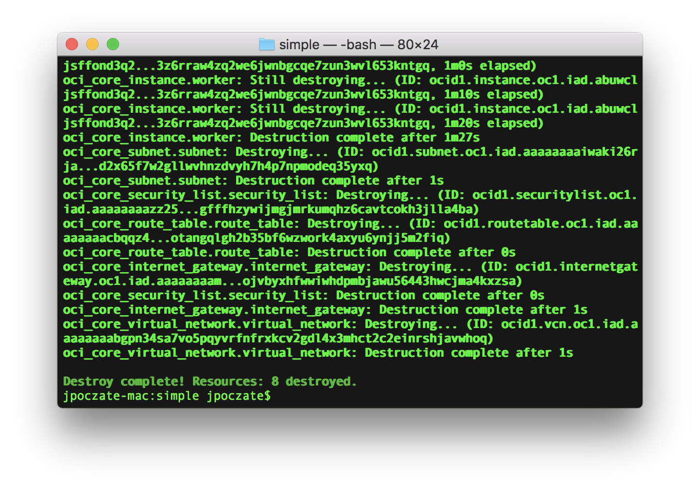

# oci-kinetica
This is a Terraform module that deploys [Kinetica](https://www.kinetica.com/) on [Oracle Cloud Infrastructure (OCI)](https://cloud.oracle.com/en_US/cloud-infrastructure).  It is developed jointly by Oracle and Kinetica.

## Prerequisites
First off you'll need to do some pre deploy setup.  That's all detailed [here](https://github.com/oracle/oci-quickstart-prerequisites).

## Clone the Module
You'll first want a local copy of this repo by running:

```
git clone https://github.com/oracle/oci-quickstart-kinetica.git
cd oci-quickstart-kinetica/simple
ls
```
That should give you this:



We now need to initialize the directory with the module in it.  This makes the module aware of the OCI provider.  You can do this by running:

```
terraform init
```
This gives the following output:



## Deploy

First we want to run `terraform plan`. This runs through the terraform and lists
out the resources to be created based on the values in `variables.tf`.

Kinetica requires a license key and running `terraform plan` or `terraform apply`
will prompt for one. You can get a trial key by going [here](https://www.kinetica.com/trial/)
and clicking `Register&Download`.

The variables you most likely would want to change are:

- `shape`: Instance type for each worker. These templates support both CPU and GPU shapes.
- `worker_count`: Number of workers.
- `ad_number`: Which availability domain to deploy to depending on quota, zero based.
- `disk_size`: Size of the block volume(s) for each worker node in GB.
- `disk_count`: Number of block volumes per worker, multiple disks will create a RAID0 array.


If that's good, we can go ahead and apply the deploy:

```
terraform apply
```

You'll need to enter `yes` when prompted.  The apply should take several minutes
to run, and the final setup of Kinetica will happen asynchronously after this returns.

Once complete, you'll see something like this:



You'll see 4 outputs that should look like this with different IPs:
```
Outputs:

GAdmin URL = http://132.145.215.17:8080
Reveal URL = http://132.145.215.17:8088
Worker server private IPs = 10.0.0.2
Worker server public IPs = 132.145.215.17
```

Point your browser at the `GAdmin URL` in the outputs. If GAdmin doesn't respond
immediately, the configuration is still finishing.

At first login with default credentials `admin/admin` you'll be prompted to set a password.




You should then see the GAdmin console.



## Destroy the Deployment
When you no longer need the deployment, you can run this command to destroy it:

```
terraform destroy
```

You'll need to enter `yes` when prompted.  Once complete, you'll see something like this:


